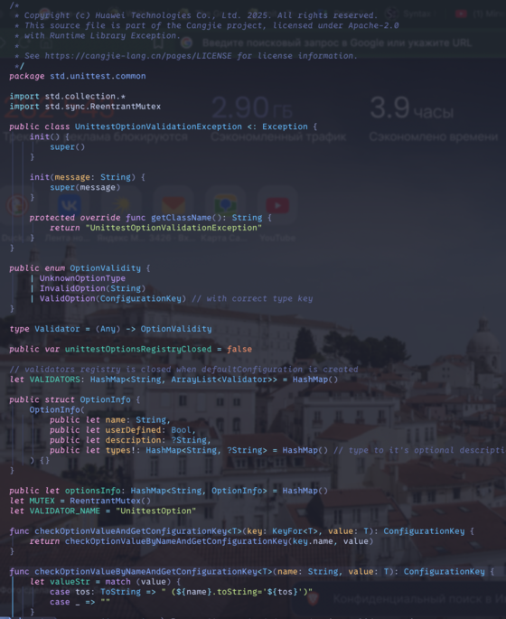

# Tree-sitter grammar for cangjie programming language

STATUS: in development



# Installation

- Clone this repo
- `tree-sitter generate && tree-siiter build`
- set up nvim-treesitter (add in nvim configs)
```lua
parser_config.cangjie = {
  install_info = {
    url = "PATH/TO/CLONED/REPO", -- local path or git repo
    files = { "src/parser.c" }, -- note that some parsers also require src/scanner.c or src/scanner.cc
    -- optional entries:
    -- branch = "main", -- default branch in case of git repo if different from master
    generate_requires_npm = false, -- if stand-alone parser without npm dependencies
    requires_generate_from_grammar = false, -- if folder contains pre-generated src/parser.c
  },
  filetype = "cj", -- if filetype does not match the parser name
}
```
- Associate file type with extension (add in nvim config)
```lua
vim.filetype.add({
  extension = {
    cj = "cj",
  },
})
```
- copy queries (file `queries/highlights.scm) to nvim (runtimepath) most likely to `~/.config/nvim/queries/cangjie/highlights.scm`

